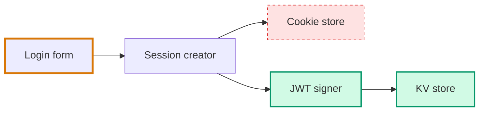

# Mermaid Theming

Architecture diagrams in sections 3 and 4 are Mermaid. Theme them so the colors match your chosen palette, not Mermaid defaults.

## CDN import

```html
<script type="module">
  import mermaid from 'https://cdn.jsdelivr.net/npm/mermaid@11/dist/mermaid.esm.min.mjs';
  import elkLayouts from 'https://cdn.jsdelivr.net/npm/@mermaid-js/layout-elk/dist/mermaid-layout-elk.esm.min.mjs';

  mermaid.registerLayoutLoaders(elkLayouts);

  const isDark = window.matchMedia('(prefers-color-scheme: dark)').matches;

  mermaid.initialize({
    startOnLoad: true,
    theme: 'base',
    look: 'classic',
    layout: 'elk',
    themeVariables: {
      // Pull from your CSS tokens — match the page exactly
      primaryColor:        isDark ? '#1c2333' : '#ffffff',
      primaryBorderColor:  isDark ? '#94a3b8' : '#475569',
      primaryTextColor:    isDark ? '#e6edf3' : '#1a1a2e',
      secondaryColor:      isDark ? '#0d1117' : '#f1f3f5',
      secondaryBorderColor:isDark ? '#34d399' : '#059669',
      lineColor:           isDark ? '#64748b' : '#94a3b8',
      fontSize: '15px'
    }
  });
</script>
```

## Theme: always 'base'

`theme: 'base'` is the only theme where `themeVariables` are fully respected. The built-ins (`default`, `dark`, `forest`, `neutral`) ignore most overrides.

## Layout: 'elk' for complex graphs

ELK auto-routes edges better than dagre. Requires the separate `@mermaid-js/layout-elk` import. If you skip the import but set `layout: 'elk'`, Mermaid silently falls back to dagre with no error.

For simple flows (<6 nodes, linear), `dagre` is fine.

## Current vs. planned diff

Sections 3 and 4 should use the **same node names and the same layout direction** (`graph TD` or `graph LR`, consistent). Then highlight differences via Mermaid CSS classes:



## Page-level CSS collision constraint

**Never define `.node` as a page-level CSS class.** Mermaid uses `.node` internally on SVG `<g>` elements for positioning. Page-level `.node` styles leak into diagrams and break layout. Use `.pr-*` namespaced classes for everything in this skill.

The only safe place to style Mermaid's `.node` is scoped under `.mermaid`:

```css
.mermaid .node rect { rx: 8; }
.mermaid .nodeLabel { font-size: 15px; }
.mermaid .edgeLabel { font-size: 12px; background: var(--surface); }
```

## Re-render on theme change

If the user toggles light/dark mode, re-init Mermaid:

```js
window.matchMedia('(prefers-color-scheme: dark)').addEventListener('change', () => {
  document.querySelectorAll('.mermaid').forEach(el => {
    el.removeAttribute('data-processed');
    el.innerHTML = el.dataset.source;
  });
  mermaid.initialize({ /* updated themeVariables */ });
  mermaid.run();
});
```

Store the original source in `data-source` before first render so you can re-render cleanly.
